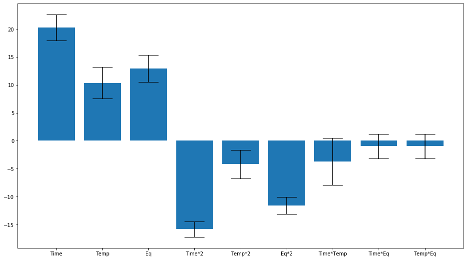
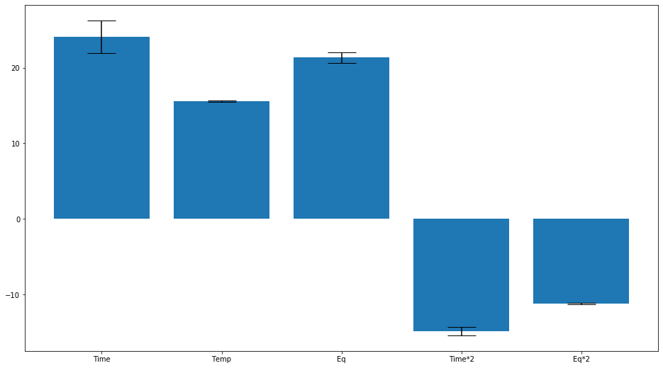
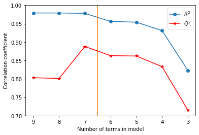

A linear model for 3 factors which is capable of distinguishing main
effects:
*y* = *β*0 + *β*1*x*1 + *β*2*x*2 + *β*3*x*3 .

A saturated model up to the power of two would be
*y* = *β*0 + *β*1*x*1 + *β*2*x*2 + *β*3*x*3
 + *β*4*x*1*x*2 + *β*5*x*2*x*3 + *β*6*x*1*x*3
 + *β*7*x*12 + *β*8*x*22 + *β*9*x*32

If a model only contains the cross terms and main effects (2 and 3 in
the equation above) it is an interaction model, if it only contains the
main and square terms it is a squared model (2 and 4 in the above
equation). The models are hierarchical: if a higher order interaction or
square term is included in the model, the linear term for that factor
must also be present (regardless of whether it is considered
statistically significant). The parsimonious model is defined as a model
in containing as few terms of any type that describe that describe the
data well.

## Checking the response plot

The first thing to do is check for experimental error.

types of error. bias error etc.

        doenut.replicate_plot(inputs, # the input dataframe
            responses, # the response dataframe
            key="ortho")

# Modelling

### Choosing a model

The best *R*2 is usually found by using a saturated model,
however, this model is often overfit and thus is worse at predicting on
new data. Often there are terms that are insignificantly different from
0, these are easily identified from the figure as if the error bars
cross the x-axis then the value of that coefficient can be replaced by
zero, and doing this reduces the overfit of the model, and thus
increases the *Q*2, and improves the efficiency of the model.
See figure <a href="#fig:coeff_egA" data-reference-type="ref"
data-reference="fig:coeff_egA">[fig:coeff_egA]</a> for an example of a
coefficient plot. The model is generally considered to be invalid if
*Q*2 and *R*2 are less than 0.5, and we expect the
difference between them to be less than 0.2 for a good model. \[\[cite
MODDE manual\]\]

We can use degrees of freedom (DoF) as another metric for choosing a
good model, higher DoF models are better (equivalently, lower numbers of
terms). DoF is given by:
*D**o**F* = *N* − *N**β**x* + 1
where *N* is the number of experiments, *N**β**x*
is the number of model terms (the +1 is due to the intercept,
*β*0).

Note that qualitative factors (i.e. solvent) have only one *β*
associated with them, but are plotted as two separate bars in the
coefficients plots in MODDE, to allow you to see which qualitative
factor is the best.

The AIC can be used be used as a metric for the model’s efficiency and
choosing the model with the lower AIC is the best.

Parsimonious models are created by successively removing the
statistically insignificantly higher order terms from a saturated model
and taking the model with the best *Q*2 (N.B. *R*2
is always higher than the *Q*2). With lower resolution models
(such as resolution IV models) it is not possible to de-confound the
higher order terms, and thus the worker must use their judgement as to
which terms are more chemically irrelevant and removable, test the
possible models or do a follow up experiment with a higher resolution.
In this work, we used our chemical reasoning and tested the model, as
our aim is to get a good enough model to optimise the system, not to
create the best model to describe the system. Predictions were then
verified using follow up experiments.

# Fit a simple first order model

The main effects in the system are those relating to the input
variables. For example, in a system with 3 input variables,
*x*1, *x*2, *x*3, the value of these
factors are the main effects on the system.

A model relates input factors to output responses.
*i**n**p**u**t**s* → *m**o**d**e**l* → *o**u**t**p**u**t**s*

A very simple model would be something like this:
*o**u**t**p**u**t**s* = *β*0 + *β*1*i**n**p**u**t*
which is simply the equation for a straight line:
*y* = *m**x* + *c*
where *c* and *β*0 are the intercept and *m* and
*β*1 are the gradient.

When you fit the equation of a line to 2D data, you are building a very
simple model to relate the output, *y*, to the input, *x*.

You can extend this to an arbitrary size of dimensions of your data. For
example, if you have 3D input data, you could build a model from this
equation:
*y* = *β*0 + *β*1*x*1 + *β*2*x*2 + *β*3*x*3
which would require you to produce 4D plots to look at it. (As an aside,
the field of machine learning is concerned with building models for very
high dimensional data).

This is a model of order 1 as all the variables are *x*1 or
below. (N.B. the first term is
*β*0*x*0 = *β*0, and is called the
\*intercept\*).

## Implementation in DoENUT

Based on scikit-learn so could add in any model here. Simpler linear
regression is the best etc.

\[\[To-DoENUT! perhaps add in an option to put in any model?\]\]

        original_model, inputs_used, original_model_R2, predictions = doenut.train_model(
        inputs, 
        responses['ortho'], 
        test_responses=None,
        do_scaling_here=False,
        fit_intercept=True,
        verbose=True)

# Prediction

<figure>

<figcaption aria-hidden="true">4D contour plot for the linear model in
section [[]]</figcaption>
</figure>

## Leave one out methodology

R2 is : . Relation to ML training set. what corerlation coeffi is and
isnt

Chemistry data hard to come by so need to make the most of the data we
have. LOOM!

We make a training set of 1 point, and build N models of N-1 points.
Should get similar R2 for each model and the errors should be evenly
distributed around zero.

The final model is averaged. Q2 calculated from each model separaetly.

Over-fitting. undertraining. R2 always more than Q2. etc. what r2 of 0
means (or less than 0).

Is your model valid? is Q2 above 0.5? if not - could be not enough data
etc.

What makes a good model *Q*2 \> 0.5, *R*2 \> 0.5,
*R*2 − *Q*2 \< 0.2.

### Example of analysing the averaged model

\[\[To-do read DoNUT to find out what all this is! is averaged error the
error for all points on that model?\]\]

Means should be similar for train and test set. Q2 calcualted etc.

Table  <a href="#tab:averaged_model" data-reference-type="ref"
data-reference="tab:averaged_model">1</a> and figure
 <a href="#fig:error_plot" data-reference-type="ref"
data-reference="fig:error_plot">[fig:error_plot]</a> show data from a
first order lienar model.
Figure <a href="#fig:error_plot" data-reference-type="ref"
data-reference="fig:error_plot">[fig:error_plot]</a> shows that the
first 16 experiments are well distributed, but the last one is an
outlier.

hhiger r2 (see table). Higher error (see figure) We do not remove this
outlier!

why? Is the highest yield point, ie what we are searching for. But this
high error suggests that the model is not very predictive at this point.
See figure <a href="#fig:linear_model_pre" data-reference-type="ref"
data-reference="fig:linear_model_pre">[fig:linear_model_pre]</a>, which
shows a yield above 100% in this area.

models are only predictive in the range they have been trianed over Do
not know chemical or phsycial facts, such that a yield above 100% is
impossible. We know that 91% is the true yeild here.

relate back to OVAT which would get the correct answer.

But our answers is close enough to proceed and test that area for better
yeilds.

Figure <a href="#fig:observed_vs_predicted" data-reference-type="ref"
data-reference="fig:observed_vs_predicted">[fig:observed_vs_predicted]</a>A
shows the model response for this data.

| Missing data point | model *R*2 | Average error |
|:-------------------|:----------------------|:--------------|
| 0                  | 0.801                 | -16.5         |
| 1                  | 0.857                 | -3.63         |
| 2                  | 0.873                 | 10.5          |
| 3                  | 0.862                 | -13.2         |
| 4                  | 0.852                 | -0.916        |
| 5                  | 0.86                  | 5.03          |
| 6                  | 0.854                 | 2.59          |
| 7                  | 0.881                 | 12.9          |
| 10                 | 0.85                  | 3.17          |
| 11                 | 0.856                 | 5.89          |
| 12                 | 0.854                 | -8.72         |
| 13                 | 0.855                 | -4.17         |
| 14                 | 0.861                 | 9.52          |
| 15                 | 0.858                 | 5.21          |
| 16                 | 0.92                  | -25.3         |

 Output from 17 models trained for LOOM
 
 A standard output is: \[\[prolly turn to a table\]\]

    Input data is 17 points long
    We are using 16 data points

    R2 overall is 0.823
    Mean of test set: 68.9
    Mean being used: 70.19411764705882
    Sum of squares of the residuals (explained variance) is 1665.7625447426085
    Sum of squares total (total variance) is 5836.321107266435
    Q2 is 0.715

<figure>

<figcaption aria-hidden="true">Error plot. The errors should be evenly
distributed around 0. This plot shows good errors except for the last
datapoint.</figcaption>
</figure>

### DoENUT implementation

        (ortho_model, predictions, ground_truth, 
        coeffs, R2s, R2, 
        Q2) = doenut.calc_averaged_model(
        inputs, 
        responses[['ortho']], 
        key='ortho',
        drop_duplicates=True,
        use_scaled_inputs=False,
        fit_intercept=True,
        do_scaling_here=False)
        
        # Analysing model

look at R2 and Q2 (and model validity and replicability) to find out if
it is a good model.

Is anything missing?

## predicted-measured plot

Analyse by plotting the observed-predicted plot. Might seem an odd way
round but we want to see how good the model is compared to the data, not
sue the model to predict data and see how good our model is. Data is
king so out model must fit the data. The line is y=x so a perfect model
would sit on this line. You want a libear scattering over this line. If
the data looks curved that shows that higher order terms are needed to
describe the data (vide infra).

Figure <a href="#fig:observed_vs_predicted" data-reference-type="ref"
data-reference="fig:observed_vs_predicted">[fig:observed_vs_predicted]</a>(top)
shows the observed-predicted plot for the dataset analysed in
section\[\[above!\]\]. There is a curve, suggesting that higher order
terms are needed.
Fig. <a href="#fig:observed_vs_predicted" data-reference-type="ref"
data-reference="fig:observed_vs_predicted">[fig:observed_vs_predicted]</a>(bottom)
shows the results for a model with higher order terms, the curved trend
has been removed.

The first order model does not seem to model the lowest and highest
point well. Expected as there is not much data in these regions. We
don’t care if it models the low yields not too well as we want to
optimise the data.

  
  

        model_1_graph= doenut.plot_observed_vs_predicted(responses['ortho'], 
            ortho_model.predict(inputs),
            range_x=[],
            label='ortho')

# Fitting a saturated model

what is the sat model. Dont need very many high order terms.

The inputs to the model are called \*features\*, these include the input
factors you’ve already used, but they can also include features that you
can create from your inputs.

For example, for a system with 2 input factors, *x*1 and
*x*2, we could create a model like this:

*y* = *β*0 + *β*1*x*1 + *β*2*x*2 + *β*3*x*1*x*2 + *β*4*x*12 + *β*5*x*22

The features in this model are: *x*1, *x*2,
*x*1*x*2, *x*12 and
*x*22.

Terms of the format *x**j*2 are called \*square
terms\* and show second order effects in the main term.

Terms of the format *x**i**x**j* are called
\*interaction terms\*, and these show the interaction between the inputs
*x**i* and *x**j*.

Both are very importent for understanding the complexity of the system
and we are using MVAT experimentation to discover these.

You may noticed that we could keep going, we could have highers powers
(e.g. *β**i**x*13 or
*β**j**x*13*x*22
etc). We make the \*assumption\* that this system is not that
complicated, so we will not consider any terms with a power higher than
2, i.e. we are setting all other possible *β* values to 0. In this
feild, the terms we add are called \*polynomial features\* and thus you
can describe this process and only considering polynomial features up to
power 2.

A \*saturated model\* is one with all the polynomial features (up to our
desired power) included. The model written above is a saturated model
for two inputs and one output.

A saturated model would have the following equation:

*y**o**r**t**h**o* = *β*0 + *β*1*x*1 + *β*2*x*2 + *β*3*x*3 + *β*4*x*12 + *β*5*x*22 + *β*6*x*32 + *β*7*x*1*x*2 + *β*8*x*1*x*3 + *β*9*x*2*x*3

The first line is the intercept, the second is the inputs, the third is
the square terms and the fourth is the interaction terms.

A \*parsimonious model\* is a model that is the simplest model we can
build that captures the behaviour of the reaction.

## DoENUT implementation

DoENUT offers the functionality to add in the higher order terms
automatically, with the option to add in only squares, only interactions
or both. The original input array in input into the function below.
Optionally, column_list will create extra terms for the subset of
columnn names input.

    sat_inputs, source_list = doenut.add_higher_order_terms(
        inputs,
        add_squares=True,
        add_interactions=True,
        column_list=[],
        verbose= True)

R2 overall is 0.956 Mean of test set: 68.9 Mean being used:
70.19411764705882 Sum of squares of the residuals (explained variance)
is 798.6438029955726 Sum of squares total (total variance) is
5836.321107266435 Q2 is 0.863

Fitting a saturation model can then be done exactly as it was done with
the simple first order model, except that now we use the saturated
inputs.

# Scaling!

Coefficients! Need to scale the system to get relative importance of
coefficients. There are two ways to build a model in DoENUT, you can
scale the coefficients or not. To build a parsimonious model you want to
scale the coefficients, so you can directly compare the relative effeect
of each input, regardless of that inputs general range. The coefficients
are scaled by teh standard deviation to take into account the range.
Once you have decided which features to include in your model, it is
best to refit the model without scaling to get the actual values,
allowing you to use the model without altering the input ranges.
Alternatively, you can use the scaled model and simply scale the inputs
by the standard deviations used to make the model.

## Removing features to get best model

The coefficients plots are given by the averaged model code, or
alternatively can be plotted using the code below, using the averaged
coefficients returned

        doenut.coeff_plot(saturated_coeffs, 
               labels=[x for x in sat_inputs.columns], 
               errors='std',
               normalise=True)

\[\[to-do plot of R2 and Q2 over removal process\]\]

To remove the coefficients by hand, use the code below. For example, to
remove the 7th term, you would replace the input_selector with
\[0,1,2,3,4,5,7\]. To have a hierarchical model, you must not remove
linear terms (e.g. *x*1) if you have higher order terms that
depend on it, (e.g. *x*1*x*2 or
*x*12). It is best to tune your model by hand, as
there are chemical considerations to take into account when choosing the
model. For example, ref Cham-Lan, there are several models with
different terms that were able to predict better reaction conditions.
Sometimes, there is a chemical reason to prefer one version over
another.

# Building a parsimonious model

<figure>

<figcaption aria-hidden="true">The coefficient correlation values for
hte trianing and test sets as terms are removed in reverse order of
their significance.[[change this get a better example
data!]]</figcaption>
</figure>

## How to choose the model

Aoicke information coefficient AOC and other things. Heuristics. etc.

Introduce the idea of test sets (and say Q2 is the verification in some
way?)

## How implemented in DoENUT

trains new model with different numbers of coefficients

    this_model, R2, temp_tuple = doenut.calulate_R2_and_Q2_for_models(
        inputs, 
        responses, 
        input_selector=[0,1,2,3,4,5,6,7], 
        response_selector=[0],
        use_scaled_inputs=True,
        do_scaling_here=True)
    new_model, predictions, ground_truth, coeffs, R2s, R2, Q2 = temp_tuple

It is possible to autotune a model, where DoENUT will sucessively remove
the smallest terms and retrain the model. It can respect hierarchical
models.

        autotune_model(
        sat_inputs,
        responses)

and this gives out the trained model, preedictions and the ground truth,
the averaged coefficients, R2 and Q2 values of the final model and also
how the R2, Q2 and number of terms changed oover the optimisation, which
can tehn be plotted using plot_training.

output_indices, new_model, predictions, ground_truth, coeffs, R2s, R2,
Q2, R2_over_opt, Q2_over_opt, n_terms_over_opt = temp_tuple

Example of building an expanded input dataframe and writing the function
for the 4D contour plot

        inputs['Time**2']=inputs['Time']*inputs['Time'] 
        inputs['Temp**2']=inputs['Temp']*inputs['Temp'] 
        inputs['Eq**2']=inputs['Eq']*inputs['Eq'] 
        def my_function_second_order(df_1):
            df_1['Time**2'] = df_1['Time']*df_1['Time']
            df_1['Temp**2'] = df_1['Temp']*df_1['Temp']
            df_1['Eq**2'] = df_1['Eq']*df_1['Eq']
            return df_1

If you have more than 3 dimensions you need ot input the other data:

example

        PC4_constant = 2
    n_points = 60
    def my_function(df_1):
        df_1['PC4']=c = np.linspace(PC4_constant, PC4_constant, 3600)
        df_1['PC1*2']= df_1['PC1']*df_1['PC1']
        df_1['PC3*2']= df_1['PC3']*df_1['PC3']
        df_1['PC4*2']= df_1['PC4']*df_1['PC4']    
        df_1['PC1*PC2']= df_1['PC1']*df_1['PC2']
        df_1['PC1*PC3']= df_1['PC1']*df_1['PC3']
        return df_1

Suggested workflow for DoE factor idenfitication and optimisation

1.  Preliminary experiments to determine the reaction works on the bench

2.  choose factors

3.  Setting up of an experimental design

4.  Preparation for automated synthesis (creating stock solution etc)

5.  check replicate plot for bias effects and check replication of
    centre points is good

6.  Fit a linear model on main effects. Examine observed-predicted plot,
    R2 and Q2 values to idenitify if higher order terms are needed

7.  add all higher order terms for the type of model to be optimised
    (i.e. saturated, square or interaction

8.  remove terms starting with the higher order least significant terms,
    and using chemical intuition

9.  choose best model based on observed-predicted plot, R2, Q2 and MV or
    AIC

10. use model to predict optimum reaction conditions

11. verify model predictions and (hopefully) optimise reaction

12. if needed: go back to step 2 to further optimise
