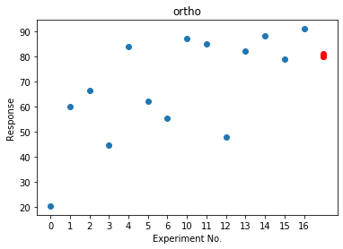

A linear model for 3 factors which is capable of distinguishing main
effects:
*y* = *β*0 + *β*1*x*1 + *β*2*x*2 + *β*3*x*3 .

A saturated model up to the power of two would be
*y* = *β*0 + *β*1*x*1 + *β*2*x*2 + *β*3*x*3
 + *β*4*x*1*x*2 + *β*5*x*2*x*3 + *β*6*x*1*x*3
 + *β*7*x*12 + *β*8*x*22 + *β*9*x*32

If a model only contains the cross terms and main effects (2 and 3 in
the equation above) it is an interaction model, if it only contains the
main and square terms it is a squared model (2 and 4 in the above
equation). The models are hierarchical: if a higher order interaction or
square term is included in the model, the linear term for that factor
must also be present (regardless of whether it is considered
statistically significant). The parsimonious model is defined as a model
in containing as few terms of any type that describe that describe the
data well.

## Checking the response plot

The first thing to do is check for experimental error.

types of error. bias error etc.

        doenut.replicate_plot(inputs, # the input dataframe
            responses, # the response dataframe
            key="ortho")

